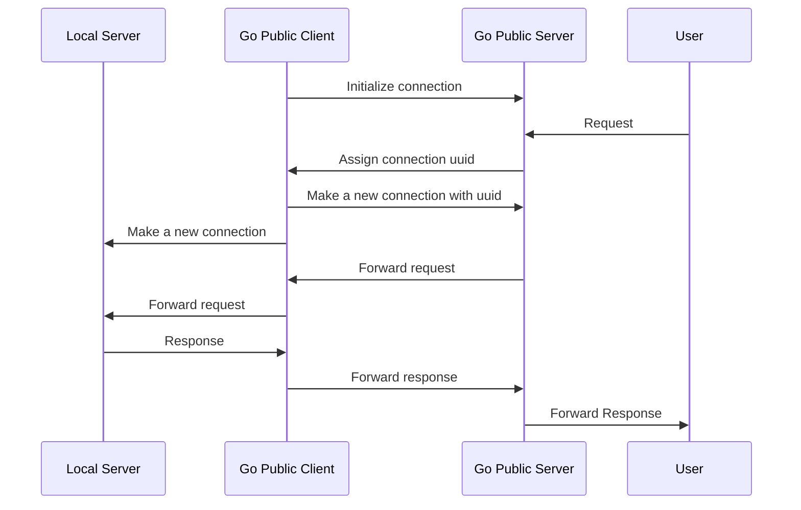

<p align="right">
   <a href="README.md">中文</a> | <strong>English</strong>
</p>

<div align="center">

# Go Public

_✨ Easily forward your local port to the public network. ✨_

</div>

<p align="center">
  <a href="https://raw.githubusercontent.com/songquanpeng/go-public/master/LICENSE">
    
  </a>
  <a href="https://github.com/songquanpeng/go-public/releases/latest">
    
  </a>
  <a href="https://github.com/songquanpeng/go-public/releases/latest">
    
  </a>
  <a href="https://hub.docker.com/repository/docker/justsong/go-public">
    
  </a>
  <a href="https://goreportcard.com/report/github.com/songquanpeng/go-public">
  
  </a>
</p>

## Features
+ [x] Very easy to use
+ [x] Support TCP
+ [ ] Support UDP
+ [x] Support IP whitelist

## Usages

### Server Side

```bash
# Init config file
./go-public init server
# Save the generated token, will be used in the client side for authentication
cat go-public-server.yaml
# Start the server
./go-public
```

Or you can use docker to run the server:
```bash
docker run -d --restart always --name go-public -p 6871:6871 -p 8080:8080 -v /home/ubuntu/data/go-public:/app justsong/go-public
```

IP whitelist configuration example:
```yaml
# go-public-server.yaml
whitelist:
  - 123.213.241.5
  - 123.213.242.9
  - 125.216.243.1
```

```bash

### Client Side

```bash
# Initialize config file
./go-public init client
# Modify the config file with your saved token
vim go-public-client.yaml
# Start the client
# Please be aware that the remote port is not the port that the server listens on 
# as specified in the configuration file, but rather the port on which you want 
# to map the local port.
./go-public <local_port> <remote_port>
# For example:
./go-public 3000 8080  # Forward local port 3000 to remote port 8080
```

## Flowchart

