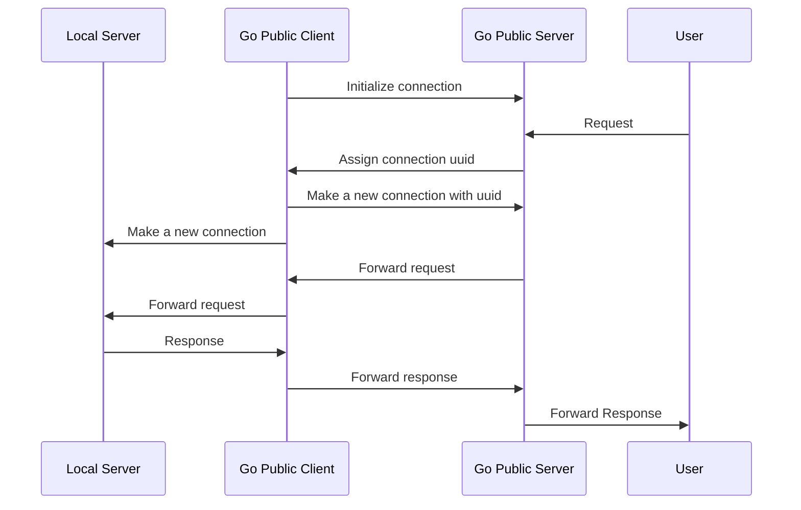

# Go Public
>  Easily forward your local port to the public network.

<p>
  <a href="https://raw.githubusercontent.com/songquanpeng/go-public/main/LICENSE">
    
  </a>
  <a href="https://github.com/songquanpeng/go-public/releases/latest">
    
  </a>
  <a href="https://github.com/songquanpeng/go-public/releases/latest">
    
  </a>
</p>

## Usages

### Server Side
```bash
# init config file
./go-public init server
# check & save the generated token
cat go-public-server.yaml
# start the server
./go-public
```

### Client Side
```bash
# init config file
./go-public init client
# modify the config file with your saved token
vim go-public-client.yaml
# start the client
./go-public <local_port> <remote_port>
```

## Flowchart
