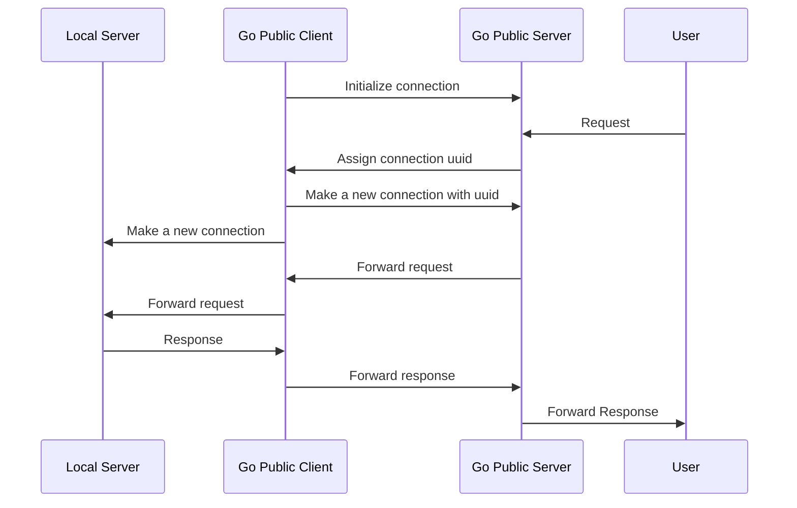

<p align="right">
   <strong>中文</strong> | <a href="./README.en.md">English</a>
</p>

<div align="center">

# Go Public

_✨ 基于 Go 的本地端口转发工具，开箱即用 ✨_

</div>

<p align="center">
  <a href="https://raw.githubusercontent.com/songquanpeng/go-public/master/LICENSE">
    
  </a>
  <a href="https://github.com/songquanpeng/go-public/releases/latest">
    
  </a>
  <a href="https://github.com/songquanpeng/go-public/releases/latest">
    
  </a>
  <a href="https://hub.docker.com/repository/docker/justsong/go-public">
    
  </a>
  <a href="https://goreportcard.com/report/github.com/songquanpeng/go-public">
  
  </a>
</p>

## 功能
+ [x] 开箱即用
+ [x] 支持 TCP
+ [ ] 支持 UDP
+ [x] 支持 IP 白名单

## 用法

### 服务端

```bash
# 初始化配置文件
./go-public init server
# 检查并保存生成的令牌
cat go-public-server.yaml
# 启动服务器
./go-public
```

或者使用 Docker 进行部署

```bash
docker run -d --restart always --name go-public -p 6871:6871 -p 8080:8080 -v /home/ubuntu/data/go-public:/app justsong/go-public
```

### 客户端

```bash
# 初始化配置文件
./go-public init client
# 使用保存的令牌修改配置文件
vim go-public-client.yaml
# 启动客户端
# 注意，远程端口不是配置文件中设置的服务器所监听的端口，
# 而是你想在哪一个端口上映射本地端口
./go-public <本地端口> <远程端口>
# 例如：
./go-public 3000 8080  # 将本地 3000 端口映射到远程服务器上的 8080 端口
```

## 流程图

